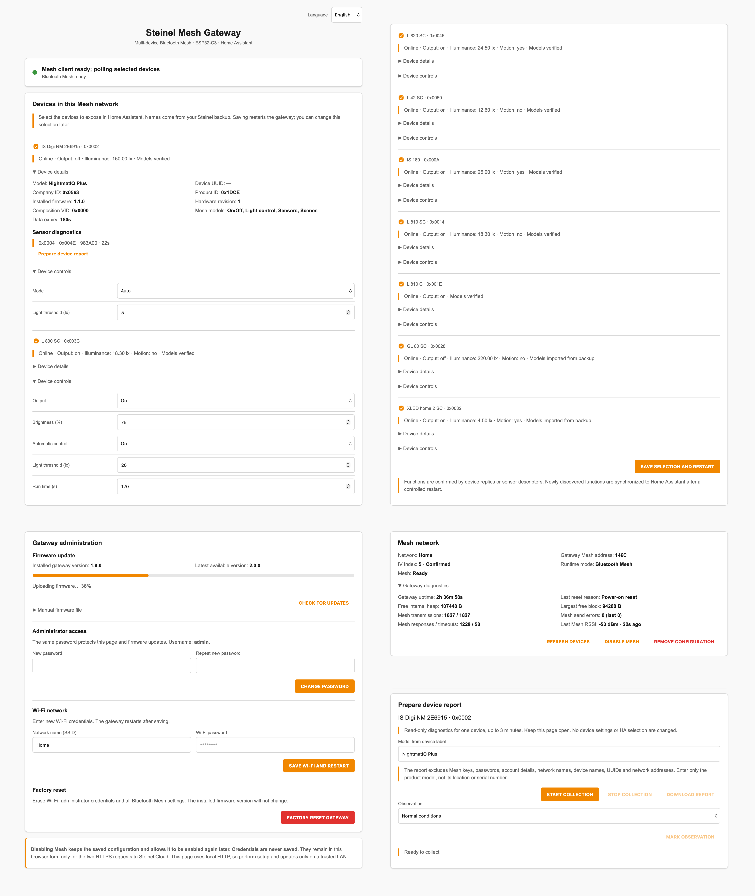

# Steinel Mesh Gateway dla ESP32-C3

[English](README.md) · [Deutsch](README_DE.md) · [Français](README_FR.md)

> **Samodzielna bramka Bluetooth Mesh dla ESP32-C3 zapewniająca lokalne sterowanie urządzeniami Steinel, diagnostykę, aktualizacje firmware i integrację z Home Assistant.**

```text
Urządzenia Steinel <-> Bluetooth Mesh <-> bramka ESP32-C3 -> Home Assistant
```

Samodzielna brama Bluetooth Mesh do instalacji Steinel, z lokalnym panelem WWW i integracją Home Assistant przez standardowe API ESPHome. Wersja **2.0.0** obsługuje wiele urządzeń z jednej sieci.

Autor i opiekun: **Bartosz Supcziński** — <bartek@env.pl>

## Dlaczego powstał ten projekt

Urządzenia Steinel Connect Mesh komunikują się przez Bluetooth Mesh, natomiast Home Assistant korzysta z sieci IP. ESP32-C3 dołącza do istniejącej instalacji Mesh, wymienia polecenia i informacje o stanie bezpośrednio z urządzeniami oraz publikuje je przez ESPHome.

Brama importuje istniejącą sieć ze Steinel Cloud lub z pliku JSON wyeksportowanego przez aplikację. Urządzenia wybierasz checkboxami w WWW. Po restarcie ich obsługiwane encje są rejestrowane w ESPHome i wykrywane przez Home Assistant. Nie trzeba wyciągać kluczy, edytować YAML dla każdej lampy, uruchamiać MQTT ani instalować niestandardowej integracji HA.

Chmura służy do konfiguracji. Codzienne sterowanie i odczyty odbywają się lokalnie przez Bluetooth Mesh i Wi-Fi.

## Zrzuty ekranu

### ESP32-C3 Super Mini


### Lokalny interfejs WWW

Wbudowana strona umożliwia konfigurację, sterowanie, diagnostykę i aktualizację firmware z przeglądarki.



### Urządzenie w Home Assistant

Standardowa integracja ESPHome udostępnia każde wybrane urządzenie osobno w Home Assistant. Poniższy zrzut pokazuje NightmatIQ Plus.


### Opcjonalne okno sterowania Home Assistant

Opcjonalny moduł interfejsu łączy stan sensora, natężenie oświetlenia, tryb pracy i próg zmierzchowy w jednym zwartym oknie dla NightmatIQ Plus.


## Co zapewnia projekt

### Lokalna integracja Bluetooth Mesh

- Import sieci Steinel z chmury lub pliku JSON wyeksportowanego przez aplikację.
- Odtworzenie klucza sieciowego, klucza aplikacji, kluczy urządzeń, IV Index i katalogu węzłów.
- Bezpośrednia komunikacja z wybranymi urządzeniami przez Bluetooth Mesh.
- Odczyt rzeczywistego stanu wyjścia, natężenia oświetlenia, progu zmierzchowego, wersji firmware, rewizji sprzętu i identyfikacji produktu.
- Sterowanie trybem pracy, wyjściem, jasnością i automatyką zgodnie z wykrytymi funkcjami.
- Zmiana progu światła i czasu świecenia zgodnie z obsługiwanym profilem urządzenia.

### Odporna obsługa adresów i sesji

- Wybór adresu Mesh bramki z niezajętej części zakresu provisionera.
- Automatyczne odzyskiwanie komunikacji, gdy urządzenia Mesh odrzucają wcześniej używany adres źródłowy.
- Zapamiętanie pierwszego potwierdzonego adresu źródłowego, aby późniejszy restart lub chwilowa niedostępność sensora nie powodowały niepotrzebnych zmian.
- Zachowanie ustawień Mesh po zwykłym restarcie i aktualizacji OTA.
- Ograniczone ponowienia i kontrolowane restarty podczas przełączania chmury i Bluetooth.

### Interfejs WWW urządzenia

- Konfiguracja sieci ze Steinel Cloud lub lokalnego backupu i wybór urządzeń checkboxami.
- Sterowanie i ręczne odświeżanie stanu.
- Zainstalowana konfiguracja i rozszerzona diagnostyka.
- RSSI Mesh, liczniki odpowiedzi, wolny RAM i największy wolny blok pamięci.
- Cztery języki WWW z zapamiętywaniem wyboru w przeglądarce.
- Raporty urządzeń pobierane jako JSON bez kluczy i prywatnych identyfikatorów.
- Chroniona hasłem aktualizacja OTA z przeglądarki.
- Panel **Gateway administration** obejmujący aktualizację firmware, zarządzanie hasłem administratora, ustawienia Wi-Fi i pełny reset fabryczny.

### Integracja z Home Assistant

Standardowe API ESPHome publikuje:

- potwierdzony stan wyjścia;
- jasność, automatyczne sterowanie i czas świecenia, jeżeli są obsługiwane;
- ruch/obecność, jeżeli urządzenie je raportuje;
- dostępność poszczególnych urządzeń;
- zmierzone natężenie oświetlenia;
- tryb pracy;
- próg zmierzchowy;
- gotowość i stan Bluetooth Mesh;
- siłę sygnału i aktualny adres IP bramki;
- wersję zainstalowanego firmware i rewizję sprzętu;
- producenta, Company ID i Product ID;
- przycisk ręcznego odświeżenia.

Home Assistant udostępnia osobne urządzenie dla każdego wybranego węzła Mesh. Standardowa integracja ESPHome zapewnia sterowanie bez brokera MQTT, niestandardowej integracji i plików YAML dla każdej lampy.

## Sprzęt i kompatybilność

### Wymagany sprzęt

- ESP32-C3 Super Mini z 4 MB pamięci flash;
- natywny port USB/JTAG do pierwszej instalacji lub odzyskiwania;
- sieć Wi-Fi 2,4 GHz;
- instalacja Steinel Connect Mesh i dostęp do jej chmury lub backupu sieci wyeksportowanego przez aplikację;

Interfejs USB zwykle pojawia się jako urządzenie Espressif USB JTAG/serial (`303a:1001`) oraz `/dev/ttyACM*` w systemie Linux.

### Obsługiwana platforma

Firmware jest przeznaczony dla ESP32-C3 i ESP-IDF. Rozszerzone funkcje Bluetooth 5 są wyłączone, ponieważ Bluetooth Mesh korzysta ze ścieżki reklamowej BLE 4.2. Konfiguracja została dopasowana do ograniczonej pamięci RAM ESP32-C3.

### Obsługiwane funkcje

| Profil / model | Dostępne funkcje |
|---|---|
| Tryb pracy urządzenia | Auto / Always On / Always Off |
| Generic OnOff Server `1000` | Potwierdzony stan wyjścia, wybór On/Off |
| Light Lightness Server `1300` | Jasność jako encja number, 0–100% |
| Light LC Server `130F` | Sterowanie automatyczne, próg światła i czas świecenia |
| Sensor Server `1100` | Natężenie światła i ruch/obecność, jeżeli urządzenie raportuje te właściwości |
| Scene / Scheduler | Rozpoznawane w metadanych; bez ogólnego edytora scen i programowania harmonogramów |

Brama sprawdza **modele SIG z przypisanym kluczem** i uwierzytelnioną Composition Data: liczbę elementów, Company/Product ID oraz zgodność z importem. Brak odpowiedzi na ten odczyt nie blokuje poprawnej komunikacji przy użyciu zaimportowanego AppKey; potwierdzona niezgodność blokuje sterowanie.

Grupy, grupy sąsiednie i Master/Slave konfiguruje się w Steinel Connect. Brama korzysta z istniejącej konfiguracji sieci, nie zmieniając jej.

Sterowanie wyjściem korzysta z pierwszego odpowiedniego modelu; wyjście Lightness ma pierwszeństwo przed osobnym OnOff. Odczyty obejmują wszystkie elementy Sensor. Niezależne wyjścia jednego urządzenia nie są wystawiane jako osobne kanały. Czujnik pozostaje nieznany, dopóki nie otrzyma właściwego raportu. Samo wysłanie polecenia nie jest potwierdzeniem stanu urządzenia.

### Urządzenia i zgodność

| Urządzenia | Sposób obsługi | Zakres / warunek |
|---|---|---|
| NightmatIQ Plus, IS 180 (wariant Mesh) | Modele SIG | Sterowanie i odczyty zgodnie z wyposażeniem i firmware urządzenia |
| L 800 SC, L 810 SC / C, L 820 SC, L 830 SC / C, L 835 SC / C, L 840 SC / C | Modele SIG | Sterowanie i odczyty zgodnie z wyposażeniem i firmware urządzenia |
| L 40 SC / C, L 42 SC / C | Modele SIG | Sterowanie i odczyty zgodnie z wyposażeniem i firmware urządzenia |
| L 270 digi SC, L 271 digi SC / C | Modele SIG | Sterowanie i odczyty zgodnie z wyposażeniem i firmware urządzenia |
| RS 200 SC / C, GL 80 SC / C | Modele SIG | Sterowanie i odczyty zgodnie z wyposażeniem i firmware urządzenia |
| Spot One SC, Spot Duo SC, Spot Way SC, Spot Garden SC, XLED home 2 SC | Modele SIG | Sterowanie i odczyty zgodnie z wyposażeniem i firmware urządzenia |

O zgodności decyduje rzeczywisty układ modeli i firmware urządzenia, nie sama nazwa handlowa. Brama sprawdza je automatycznie. Wersje C bez czujnika nie zyskują dzięki bramie własnych czujników.

Wszystkie pozycje wymagają prawidłowego backupu sieci Connect, Company ID `0x0563`, obsługiwanych modeli przypisanych do importowanego AppKey i spełnienia limitów poniżej. Lista nie obejmuje starszego własnościowego Bluetooth, zwykłych wersji bez łączności, urządzeń wyłącznie Z-Wave/KNX/DALI ani przycisków mających tylko modele klienckie. Konwersja Mesh może być nieodwracalna i zmieniać zgodność ze starszymi urządzeniami; przed aktualizacją lampy sprawdź [FAQ Steinel Connect](https://www.steinel-shop.de/service/produktinfos-beratung/faq/faq-connect-app/).

Zobacz [szczegóły zgodności](docs/DEVICE_COMPATIBILITY.md) i [opis wydania 2.0.0](docs/releases/v2.0.0.md).

## Identyfikacja i wykrywanie funkcji

Każde wybrane urządzenie ma taką samą kartę WWW, rozwijane szczegóły i osobne urządzenie w HA. Funkcje są wykrywane z uwierzytelnionych odpowiedzi albo deskryptorów czujnika. Sama obecność modelu LC lub Sensor nie powoduje tworzenia wszystkich możliwych encji. Zapis wymaga bieżącej odpowiedzi urządzenia. Nowe funkcje są zapisywane i synchronizowane przez kontrolowany restart, ponieważ encje natywnego API ESPHome trzeba rejestrować przy starcie. Przy wolnych lub niedostępnych urządzeniach wykrywanie może wymagać kilku cykli.

Szczegóły pokazują model, producenta, Company/Product ID i modele Mesh, a także wersję firmware i rewizję sprzętu, jeżeli urządzenie je udostępnia. Adresy Mesh i identyfikatory szesnastkowe mają małe litery. UUID i Composition VID nie są wyświetlane w zwykłych szczegółach WWW.

Główna lista zawiera urządzenia Steinel. Wpisy bez identyfikatora producenta trafiają do osobnej sekcji **Nierozpoznane urządzenia**; urządzenia rozpoznane jako inny producent są pomijane. Po imporcie logowanie do chmury i import lokalnego backupu są zwinięte w sekcji **Zmień lub ponownie importuj sieć** i pozostają dostępne na potrzeby późniejszej zmiany konfiguracji.

Wybrane ustawienia pojawiają się od razu w WWW i Home Assistant, a ich potwierdzenie odbywa się w tle. Rzeczywisty stan wyjścia i pomiary pochodzą z odpowiedzi urządzenia, nie z wyliczeń. Odczyt wyjścia po zmianie sterowania ma pierwszeństwo i jest ponawiany bez czekania na kolejny zwykły cykl odpytywania. NightmatIQ Plus udostępnia tryb pracy, próg zmierzchowy, natężenie oświetlenia i rzeczywisty stan wyjścia, bez sterowania jasnością ani czasu świecenia po wykryciu ruchu.

## Limity i RAM

- Jedna sieć i jedna para NetKey/AppKey, do **16 importowanych urządzeń**, **8 elementów na urządzenie** i **16 grup publikacji czujników**.
- Modele wymagające innego AppKey nie są udostępniane do sterowania.
- Kolejka 16 wpisów łączy niewysłane zmiany; jeden wpis jest zarezerwowany na kontynuację lub ponowną próbę transakcji.
- Jedna transakcja wymagająca odpowiedzi naraz; kontrola adresu, opcode i właściwości. Ograniczona ponowna próba zapisu z tym samym TID.
- Odczyty są tworzone kolejno, bez rozbudowanej kolejki wszystkich urządzeń.
- Czytnik flash z buforem 512 bajtów nie przechowuje całego JSON w RAM.
- Backup jest tymczasowo zapisywany w **nieaktywnej partycji OTA**. Import nadpisuje poprzedni obraz tej partycji; dane robocze są potem kasowane.
- HTTPS i aktywny Mesh działają w osobnych trybach. Przed ponownym importem wyłącz Mesh.
- Zmiana wyboru urządzeń wymaga kontrolowanego restartu. Pusty wybór wyłącza Mesh bez kasowania kluczy.
- Dostępność urządzenia i poszczególne wartości wygasają po trzech minutach, z ograniczonym wydłużeniem zależnym od liczby potwierdzonych funkcji większej sieci. Pełny cykl odczytów dużej lub częściowo niedostępnej sieci może trwać dłużej niż 30 sekund.

Panel diagnostyczny pokazuje wolny RAM i największy blok pamięci podczas pracy. Raport kompilacji podaje osobno statyczne wykorzystanie RAM i flash przez firmware.

Aby zgłosić kolejne urządzenie, otwórz jego szczegóły i wybierz **Przygotuj raport urządzenia**. Wpisz model z etykiety, rozpocznij zbieranie i opcjonalnie oznacz obserwacje, np. zasłonięcie czujnika lub wywołanie ruchu. **Pobierz raport** zatrzymuje zbieranie i zapisuje jeden plik JSON do załączenia w zgłoszeniu. Sesja trwa do trzech minut, wykonuje tylko odczyty i działa także dla zaimportowanych urządzeń niewybranych do HA. Raport pomija klucze, hasła, dane konta, prywatne nazwy, UUID i adresy sieciowe. Zawiera Composition Data, identyfikatory modeli SIG i producenta, surowe odpowiedzi, błędy oraz oznaczenia skróconych lub brakujących danych. Bramka utrzymuje jeden ograniczony bufor RAM; historię zbiera przeglądarka, dlatego pozostaw stronę otwartą. Po utracie połączenia nadal można pobrać zebrane dane, a raport oznaczy niepotwierdzone zatrzymanie lub nieudany końcowy odczyt.

Stan wyjścia i sterowanie automatyczne są wyborami On/Off w HA. Po wygaśnięciu ich odczytów stan staje się nieznany. Szczegóły urządzenia pokazują do ośmiu surowych właściwości Sensor, osobno dla każdego elementu, z wiekiem danych i oznaczeniem skrócenia. Ten sam ograniczony zestaw udostępnia domyślnie wyłączona encja tekstowa **Sensor diagnostics** w HA. Odczyty nie są zapisywane do flasha.

W automatyzacjach sprawdzaj encję **Available** danego urządzenia. Stan wyjścia i automatyki jest wyborem On/Off; po wygaśnięciu odczytu staje się nieznany. Brama odrzuca sterowanie urządzeniami bez świeżej odpowiedzi lub przy potwierdzonej niezgodności Composition Data.

## Bezpieczeństwo

- Fabryczne konto administratora to `admin` z hasłem `12345678`; zmień je na stronie urządzenia po połączeniu z Wi-Fi.
- Hasło administratora chroni lokalną stronę i aktualizacje firmware oraz jest zapisywane w NVS ESP32.
- Punkt dostępowy do konfiguracji używa fabrycznego hasła `12345678`.
- Konfiguruj, przesyłaj backup i aktualizuj wyłącznie w zaufanej sieci LAN. HTTP Digest uwierzytelnia, ale nie szyfruje HTTP.
- Dane logowania Steinel służą do HTTPS i nie są zapisywane.
- Klucze sieci/urządzeń i konfiguracja są przechowywane w NVS ESP32. Płytkę traktuj jak urządzenie zawierające dane dostępowe sieci.
- Domyślne API ESPHome nie jest szyfrowane; szyfrowanie możesz włączyć we własnym buildzie.
- Nie publikuj backupów, haseł, kluczy ani przechwyconych transmisji.
- Reset fabryczny usuwa Wi-Fi, administratora i konfigurację Mesh, pozostawiając wersję firmware.

## Struktura repozytorium

| Ścieżka | Przeznaczenie |
|---|---|
| `esphome/steinel-c3.yaml` | Główna konfiguracja firmware ESPHome |
| `esphome/components/steinel_mesh/` | Komponent Bluetooth Mesh, katalog urządzeń, import Steinel Cloud i lokalne WWW |
| `esphome/components/steinel_mesh/mesh_protocol.h` | Przenośne funkcje protokołu i walidacji |
| `esphome/components/steinel_mesh/steinel_nodes.cpp` | Encje urządzeń i kolejka transakcji |
| `scripts/` | Instalacja, walidacja, USB, OTA i przygotowanie wydań |
| `tests/` | Testy protokołu, parsera, komunikacji i interfejsu WWW |
| `home-assistant/` | Opcjonalny pakiet i zwarte okno sterowania Home Assistant |
| `docs/images/` | Publiczne obrazy README |
| `docs/DEVICE_COMPATIBILITY.md` | Obsługiwane urządzenia i szczegóły zgodności |
| `docs/releases/` | Opisy wydań |
| `demo/` | Lokalne demo interfejsu WWW |

## Instalacja gotowego firmware

Zalecana pierwsza instalacja nie wymaga kompilowania ESPHome:

1. Pobierz najnowszy plik `steinel-mesh-esp32-c3-gateway-vX.Y.Z-factory.bin` z [wydań GitHub](https://github.com/supczinskib/steinel-mesh-gateway/releases/latest).
2. Otwórz [ESPHome Web](https://web.esphome.io/) w przeglądarce obsługującej WebSerial i podłącz ESP32-C3 przez USB.
3. Wybierz płytkę, użyj **Install** i wskaż pobrany plik `-factory.bin`.
4. Po instalacji przejdź do sekcji **Połączenie z Wi-Fi** i **Połączenie z siecią Steinel Mesh** poniżej.

ESPHome Web przetwarza plik lokalnie. Obraz `-factory.bin` służy do nowej płytki lub odzyskiwania przez USB; późniejsze aktualizacje z przeglądarki używają obrazu `-ota.bin`.

## Budowanie ze źródeł

## Wymagania

- komputer z systemem Linux lub macOS;
- Python 3.12–3.14 i obsługiwane środowisko ESPHome;
- dostęp USB przy pierwszej instalacji;
- dostęp sieciowy do ESP32-C3; Internet podczas konfiguracji z użyciem Steinel Cloud;
- Home Assistant jest opcjonalny.

Dostarczony instalator tworzy odizolowane, powtarzalne środowisko z niezmodyfikowanym ESPHome `2026.7.3`. Do zainstalowanego pakietu ESPHome nie jest nakładany żaden patch.

Dostarczony instalator korzysta z apt w Debianie/Ubuntu. Na macOS użyj środowiska wirtualnego Python 3.12–3.14 z ESPHome `2026.7.3`. Skrypty pomocnicze obsługują też zmienną `ESPHOME` wskazującą jego plik wykonywalny.

## 1. Pobranie i przygotowanie projektu

Sklonuj lub pobierz repozytorium, przejdź do jego katalogu i zainstaluj przypięte środowisko:

```bash
sudo bash scripts/01_install_esphome.sh
```

## 2. Walidacja

```bash
bash scripts/03_validate_all.sh
```

Polecenie wykonuje kontrolę repozytorium i sprawdza konfigurację ESPHome.

```sh
bash scripts/00_self_test.sh
bash scripts/11_test_mesh.sh
esphome compile esphome/steinel-c3.yaml
bash scripts/10_prepare_release.sh
```

Testy protokołu i parsera backupu używają AddressSanitizer/UndefinedBehaviorSanitizer oraz danych syntetycznych. Sprawdzają ucięte pakiety/JSON, kompozycję, nakładające się adresy, limity grup, przypisania kluczy i dopasowanie odpowiedzi.

Jeżeli powłoka eksportuje inne ESP-IDF, użyj czystej powłoki albo `env -u IDF_PATH -u IDF_TOOLS_PATH esphome compile esphome/steinel-c3.yaml`.

Testy panelu: `cd tests && npm install && npm test`. Biblioteka jsdom jest używana tylko w testach, nie trafia do firmware. Sprawdzane są cztery języki, zapamiętywanie wyboru, dynamiczne karty urządzeń, zachowanie checkboxów i niezmienione wartości poleceń API.

## 3. Pierwsza instalacja lub odzyskiwanie przez USB

Podłącz ESP32-C3 i w miarę możliwości użyj stabilnej ścieżki `/dev/serial/by-id/`:

```bash
sudo bash scripts/09_upload_usb.sh /dev/serial/by-id/usb-Espressif_USB_JTAG_serial_debug_unit_*-if00
```

Jeżeli płytka nie ma dowiązania `by-id`, użyj wykrytego portu ACM:

```bash
sudo bash scripts/09_upload_usb.sh /dev/ttyACM0
```

Ten sam skompilowany obraz można zainstalować na każdej obsługiwanej płytce ESP32-C3. Pierwsza instalacja przez USB przygotowuje urządzenie do kolejnych aktualizacji z przeglądarki, dlatego później zwykle nie trzeba używać przycisku BOOT.

## 4. Połączenie z Wi-Fi

1. Połącz się z punktem dostępowym `nightmatiq-gateway-XXXXXX`, używając hasła `12345678`.
2. W portalu konfiguracji wybierz docelową sieć Wi-Fi 2,4 GHz i wpisz jej hasło.
3. Poczekaj, aż bramka uruchomi się ponownie i połączy z wybraną siecią.
4. Otwórz adres przydzielony przez router albo nazwę urządzenia zakończoną `.local`.

Konfiguracja Wi-Fi jest zapisywana przez urządzenie i pozostaje po aktualizacji firmware.

## 5. Połączenie z siecią Steinel Mesh

1. Otwórz adres bramki w przeglądarce.
2. Zaloguj się jako `admin`, używając fabrycznego hasła `12345678`.
3. W panelu administracyjnym zmień hasło w sekcji dostępu administratora. To samo hasło będzie zatwierdzało kolejne aktualizacje firmware.
4. Po automatycznym restarcie zaloguj się ponownie.
5. Wpisz dane konta Steinel Cloud i pobierz listę sieci.
6. Wybierz instalację, zainstaluj konfigurację i poczekaj na restart. Alternatywnie prześlij JSON sieci wyeksportowany przez aplikację w sekcji importu lokalnego backupu; przed importem wyłącz Mesh.
7. Zaznacz urządzenia, które mają być widoczne w HA, i zapisz wybór z restartem.

Początkowy adres urządzenia jest opcjonalny; pozostaw wybór automatyczny, jeżeli nie potrzebujesz konkretnego adresu. IV Index zwykle synchronizuje się z siecią. Dane logowania Steinel pozostają tylko w formularzu przeglądarki na czas żądań konfiguracyjnych.

Wybór można później zmienić w tym samym panelu. Po zmianie urządzeń lub kluczy w aplikacji Steinel wyłącz Mesh i zaimportuj świeży backup. Poprzedni wybór jest zachowywany według tożsamości urządzeń, jeśli to możliwe.

WWW obsługuje **angielski, polski, niemiecki i francuski**. Domyślny jest angielski; przełącznik pamięta wybór w tej przeglądarce. Nazwy urządzeń, dane konta i wartości poleceń API nie są tłumaczone.

## 6. Aktualizacja przez Wi-Fi

Po otwarciu strony bramka sprawdza najnowsze stabilne wydanie GitHub; **CHECK FOR UPDATES** powtarza sprawdzenie ręcznie. Gdy dostępna jest nowsza wersja, **DOWNLOAD AND INSTALL** pobiera ją przez HTTPS, sprawdza rozmiar i sumę SHA-256, instaluje oraz restartuje bramkę. Nieudana aktualizacja pozostawia dotychczasowy firmware aktywny.

Instalacja ręczna pozostaje dostępna w sekcji **Manual firmware file**. Używaj wyłącznie pliku wydania zakończonego `-ota.bin`; `-factory.bin` służy tylko do pierwszej instalacji przez USB. Użytkownik nie otrzymuje ani nie musi znać osobnego „hasła OTA”.

**Factory reset** usuwa ustawienia Wi-Fi, administratora i Bluetooth Mesh, a następnie przywraca fabryczne konto i punkt dostępowy bez zmiany zainstalowanej wersji firmware.

Z wiersza poleceń — podaj hasło administratora, gdy skrypt o nie poprosi:

```bash
bash scripts/05_upload_ota.sh ADRES_IP_LUB_NAZWA_HOSTA
```

W panelu WWW użyj obrazu **OTA**, nie factory. Wi-Fi, dane administratora i zapisana konfiguracja Mesh zostają zachowane.

## 7. Integracja z Home Assistant

Użyj **Home Assistant 2025.7 lub nowszego** z [obsługą urządzeń podrzędnych ESPHome](https://www.home-assistant.io/blog/2025/07/02/release-20257/#noteworthy-improvements-to-existing-integrations).

Home Assistant zwykle wykrywa bramkę automatycznie przez ESPHome. Jeżeli tak się nie stanie:

1. Otwórz **Ustawienia → Urządzenia oraz usługi**.
2. Dodaj integrację **ESPHome**.
3. Podaj adres IP lub nazwę hosta bramki.
4. Przypisz wybrane urządzenia Steinel do właściwych obszarów.

Każdy wybrany węzeł Mesh pojawia się jako osobne urządzenie z własnym sterowaniem i diagnostyką. Diagnostyka bramki pokazuje jej aktualny adres IP.

Wyłączenie Mesh lub przejście do trybu aktualizacji firmware zachowuje wybrane urządzenia i ich encje w Home Assistant, wraz z przypisaniem do obszarów. Po zatrzymaniu komunikacji odczyty stają się niedostępne; urządzenia nie są usuwane.

HA może zachować wpisy urządzeń usuniętych z wyboru; nieużywane wpisy usuń ręcznie.

## 8. Opcjonalne zwarte okno Home Assistant

Standardowa integracja ESPHome udostępnia wszystkie encje i elementy sterujące. Pliki w `home-assistant/` dodają zwarty kafelek obszaru i pokazane wyżej okno sterowania.

1. Skopiuj `steinel-nightmatiq-package.yaml` do katalogu pakietów Home Assistant.
2. Skopiuj `steinel-nightmatiq-popup.js` do `/config/www/`.
3. Dodaj `/local/steinel-nightmatiq-popup.js?v=200` jako moduł JavaScript w zasobach panelu.
4. Przeładuj konfigurację pakietów i odśwież pamięć podręczną przeglądarki.

Moduł automatycznie rozpoznaje urządzenie, jeżeli jest dokładnie jeden pasujący kandydat. Przy kilku pasujących urządzeniach ustaw `window.steinelNightmatiqEntities` w pliku JavaScript i mapowanie `target_entities` w pakiecie YAML na identyfikatory wybranego urządzenia. Sprawdź te przypisania, jeżeli HA dopisał `_2` lub inny sufiks. To opcjonalne okno jest przeznaczone dla NightmatIQ Plus; inne urządzenia korzystają ze standardowego sterowania HA.

Moduł dostosowuje automatycznie wygenerowany kafelek obszaru i okno szczegółów Home Assistant. Ponieważ strategia obszaru jest częścią interfejsu Home Assistant, przyszła wersja frontendu może wymagać aktualizacji opcjonalnego modułu.

Widok obszaru pokazuje jeden kafelek stanu czujnika, który otwiera okno sterowania. Dodatkowe kafelki tego samego czujnika są pomijane w tym widoku bez wyłączania ich encji ani automatyzacji. Automatyczne rozpoznawanie urządzenia sprawdza tożsamość bramki, a nie tylko podobne nazwy encji z innych integracji.

## Wiele bramek

Podczas importu sieci każda bramka wyznacza politykę adresu Mesh na podstawie wybranej instalacji i własnej tożsamości sprzętowej. Ten sam firmware można dzięki temu skonfigurować dla różnych płytek ESP32-C3 i instalacji Steinel.

Sufiks MAC w nazwie urządzenia jest domyślnie włączony, dlatego wiele bramek otrzymuje unikalne nazwy hostów i punktów dostępowych. Na każdej bramce ustaw osobne hasło administratora.

## Awaryjny punkt dostępowy

Jeżeli skonfigurowana sieć Wi-Fi jest niedostępna przez 60 sekund, bramka ponownie uruchamia chroniony punkt dostępowy. Połącz się z nim fabrycznym hasłem AP `12345678` i zmień konfigurację Wi-Fi w portalu. Lokalna strona nadal jest chroniona hasłem administratora wybranym na urządzeniu.

## Rozwiązywanie problemów

### Bramka nie pojawia się w Home Assistant

- Sprawdź, czy Home Assistant ma dostęp do bramki w sieci IoT.
- Jeżeli wykrywanie między VLAN-ami jest filtrowane, dodaj integrację ESPHome ręcznie po adresie IP.
- Sprawdź, czy bramka jest online, i uruchom ponownie integrację ESPHome, jeżeli połączenie nadal jest niedostępne.

### Mesh jest gotowy, ale wartości pozostają niedostępne

- Umieść ESP32-C3 bliżej wybranych urządzeń Steinel i sprawdź **Ostatnie RSSI Mesh** w diagnostyce.
- Po imporcie kopii sieci poczekaj na synchronizację IV Index.
- Użyj przycisku **Odśwież urządzenia**, aby zażądać aktualnego stanu.

### Nie udaje się pobrać sieci Steinel

- Sprawdź, czy konto ma dostęp do instalacji w oficjalnej aplikacji Steinel.
- Sprawdź dostęp do Internetu, DNS i czas systemowy w sieci bramki.
- Po nieudanym żądaniu konfiguracji poczekaj na restart bramki i spróbuj ponownie.

### Aktualizacja OTA nie działa

- Sprawdź adres urządzenia i hasło administratora bramki.
- Użyj aktualizacji z przeglądarki w zaufanej sieci LAN.
- Jeżeli urządzenie nie łączy się już z Wi-Fi, odzyskaj je przez natywny port USB.

## Powiązany projekt

Ta sama funkcjonalność Steinel NightmatIQ Plus jest również dostępna jako opcjonalna integracja w projekcie [AR01V3 RF/IR, ESP-RC01 & Steinel NightmatIQ Plus Gateway](https://github.com/supczinskib/athom-ar01v3-esp-rc01-gateway). Wybierz tamten projekt, jeśli NightmatIQ ma być dodatkiem do istniejącej wielofunkcyjnej bramki AR01V3; to repozytorium jest przeznaczone dla małej, dedykowanej instalacji ESP32-C3.

## Licencja

Copyright (C) 2026 Bartosz Supcziński.

Projekt jest udostępniany wyłącznie na warunkach GNU General Public License w wersji 3 (`GPL-3.0-only`). Pełna treść znajduje się w pliku [LICENSE](LICENSE).

## Autor i wsparcie

- Autor i opiekun projektu: **Bartosz Supcziński**, <bartek@env.pl>.
- Identyfikator projektu ESPHome: `envpl.steinel_mesh_gateway`.

Zgłaszając problem, podaj wersję firmware, wersję ESPHome, przyczynę ostatniego restartu i odpowiednie logi. Przed udostępnieniem diagnostyki usuń hasła, klucze, nagłówki autoryzacji, prywatne kopie i identyfikatory sieci.

To niezależny projekt społecznościowy, który nie jest oficjalnym produktem Steinel, ESPHome ani Home Assistant.
